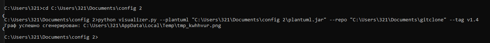
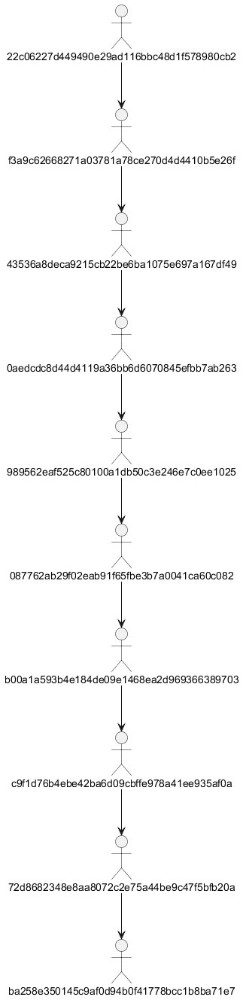
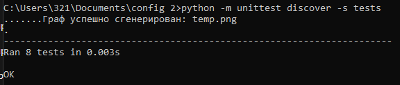

## Общее описание

Этот проект представляет собой инструмент командной строки, который анализирует зависимости между коммитами в git-репозитории и строит граф зависимостей в формате PNG, который можно визуализировать с помощью программы PlantUML.

Граф зависимостей отображает, как коммиты в репозитории связаны друг с другом, включая транзитивные зависимости. Каждый коммит отображается как узел в графе, а рёбра между узлами показывают, какие коммиты зависят от каких.

Граф необходимо строить для тега с заданным именем.

## Описание всех функций и настроек

Ключами командной строки задаются:

- Путь к программе для визуализации графов.
- Путь к анализируемому репозиторию.
- Имя тега в репозитории.

### Функции

1. **`get_commits(repo_path, tag_name)`**  
   Извлекает информацию о коммитах в указанном репозитории для заданного тега. Возвращает список коммитов с их хэшами и хэшами родительских коммитов.

   **Аргументы:**
   - `repo_path` — путь к git-репозиторию.
   - `tag_name` — имя тега, для которого нужно получить коммиты.

   **Возвращает:**
   - Список коммитов, где каждый коммит представлен в виде списка:
    - Хэш коммита
    - Список хэшей родительских коммитов

2. **`generate_plantuml(commits)`**  
   Генерирует текст PlantUML для визуализации графа зависимостей между коммитами.

   **Аргументы:**
   - `commits` — список коммитов, полученных с помощью get_commits.

   **Возвращает:**
   - Строку, содержащую текст в формате PlantUML, который описывает граф зависимостей.

3. **`visualize_graph(plantuml_text, plantuml_path)`**  
   Генерирует графическое изображение зависимостей между коммитами с помощью PlantUML и сохраняет его в файл.

   **Аргументы:**
   - `plantuml_text` — текст PlantUML, описывающий граф зависимостей.
   - `plantuml_path` — путь к исполняемому файлу PlantUML (например, plantuml.jar).

   **Возвращает:**
   - Строку с путём к сохранённому изображению графа.

4. **`main(config_path)`**  
   Основная функция, которая запускает процесс извлечения коммитов, генерации текста для PlantUML и визуализации графа.

## Описание команд для сборки проекта


### Запуск визуализатора

Для того чтобы использовать инструмент для визуализации графа, выполните команду:

```bash
python visualizer.py --plantuml "C:\Users\321\Documents\config 2\plantuml.jar" --repo "C:\Users\321\Documents\gitclone" --tag v1.4
```
Команда состоит из: python {'название файла'} --plantuml {'путь к plantuml.jar'} --repo {'путь к репозиторию'} --tag {'название тэга'}

### Запуск тестов

Для того чтобы проверить функциональность проекта, можно запустить тесты с помощью `unittest`. Выполните команду:

```bash
python -m unittest discover -s tests
```

Это выполнит все тесты, включая те, которые проверяют работу функций визуализатора.

### Пример использования

1. **Создайте git-репозиторий с тэгом** (или используйте уже существующий).
2. **Подготовьте plantuml.jar** для графического представления.
3. **Запустите визуализатор**, используя команду (команда является примером):
   ```bash
   python visualizer.py --plantuml "C:\Users\321\Documents\config 2\plantuml.jar" --repo "C:\Users\321\Documents\gitclone" --tag v1.4
   ```

В результате будет создан файл в формате PNG.

## Пример ввода команды


## Результат работы программы


## Результаты прогона тестов
